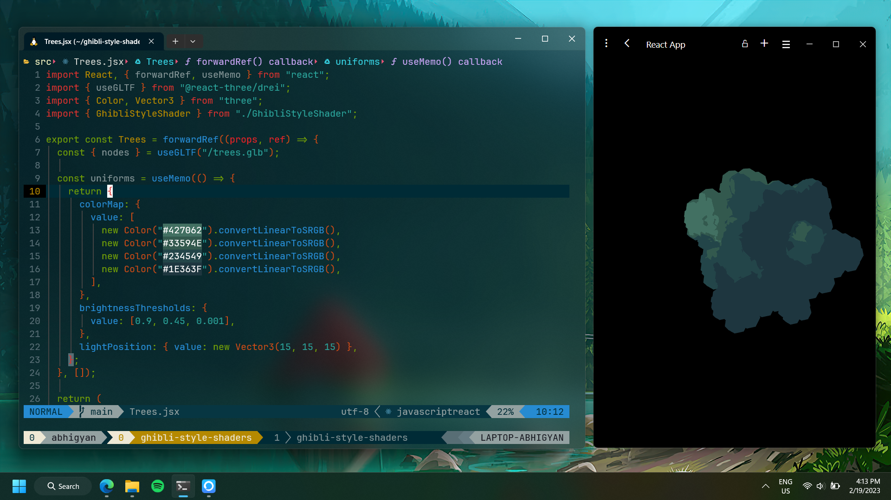

# Ghibli Style Shaders: ThreeJS

This repository is for the tutorial I followed on YouTube by Takuya Matsuyama ([craftzdog](https://github.com/craftzdog)). [Here](https://www.youtube.com/watch?v=IGK6eceWyU4) is a link to his tutorial.



## Libraries Used

- [React](https://reactjs.org/) - A JavaScript library for building user interfaces
- [ThreeJS](https://threejs.org/) - A Javascript library for rendering 3D models
- [React-Three-Fiber](https://docs.pmnd.rs/react-three-fiber/getting-started/introduction) - A React renderer for ThreeJS
- [@react-three/drei](https://www.npmjs.com/package/@react-three/drei) - A collection of helpers for [React-Three-Fiber](https://docs.pmnd.rs/react-three-fiber/getting-started/introduction)

# Start local server for project

```shell
npm start
```

## Directory Structure

```
$PROJECT_ROOT
|   # Source Code for the project
├── src
|   # Static files for images and 3d model file
├── public
```

## License

MIT
